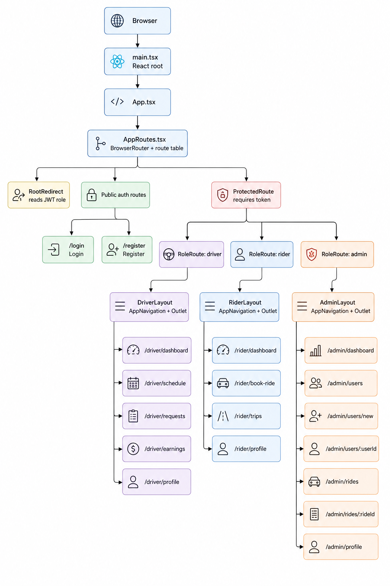

# DirectRide Frontend

A modern ride-booking web application built with React and TypeScript.
DirectRide provides separate experiences for riders, drivers, and admins, with role-based routing and protected app modules.

---

## Frontend Architecture



---

## Tech Stack

- React
- TypeScript
- React Router
- Vite
- CSS modules by feature/page
- LocalStorage for JWT handling

---

## Deployment

The frontend builds with Vite and deploys the generated `direct-ride-web/dist` assets to an S3 bucket. Account-specific AWS details are read from environment variables so the same flow works after moving to a new AWS account.

### Required Values

Set these values locally or as GitHub repository variables/secrets:

| Name | Type | Description |
| --- | --- | --- |
| `AWS_REGION` | Variable or secret | AWS region that contains the S3 bucket. |
| `S3_BUCKET` | Variable or secret | Frontend hosting bucket name. |
| `VITE_API_BASE_URL` | Variable | Production backend API base URL used at build time. |
| `AWS_DEPLOY_ROLE_ARN` | Secret | IAM role ARN in the new AWS account for GitHub Actions OIDC deploys. |
| `CLOUDFRONT_DISTRIBUTION_ID` | Variable or secret, optional | CloudFront distribution to invalidate after S3 sync. |

### Local Deploy

```sh
cd direct-ride-web
export AWS_REGION=us-east-1
export S3_BUCKET=your-frontend-bucket-name
export VITE_API_BASE_URL=https://your-api.example.com
export CLOUDFRONT_DISTRIBUTION_ID=E1234567890ABC # optional
npm run deploy
```

The deploy script uploads hashed assets with long-lived cache headers and uploads `index.html` with revalidation headers so new app releases are picked up quickly.

### GitHub Actions Deploy

The workflow in `.github/workflows/deploy-frontend.yml` runs on pushes to `main` and can also be run manually. Configure these repository variables or secrets:

- `AWS_REGION`
- `S3_BUCKET`
- `CLOUDFRONT_DISTRIBUTION_ID` if the site is behind CloudFront

Configure this repository variable:

- `VITE_API_BASE_URL`

Configure this repository secret:

- `AWS_DEPLOY_ROLE_ARN`

In the new AWS account, the role should trust GitHub OIDC for this repository and allow `s3:ListBucket`, `s3:PutObject`, and `s3:DeleteObject` for the frontend bucket. If CloudFront is used, also allow `cloudfront:CreateInvalidation` for the distribution.

---

## Features

### Authentication
- JWT-based login
- Role-based redirects for Rider, Driver, and Admin users
- Protected routes with automatic redirects
- Shared token parsing for string and numeric role values

### Admin Module
Designed for administrators to monitor and manage the DirectRide platform.

Screens:
- Dashboard
  - Admin landing page for future platform metrics
- Users
  - Backend-driven paginated users table
  - Backend-driven search and role/status filters
  - View button for user details
  - Add User flow for Rider, Driver, and Admin accounts
- User Details
  - View user profile information
  - Edit user info through the Users service
  - Deactivate action UI
  - Driver-only availability management
  - Admin date picker can view and adjust availability for any date, including past dates
- Rides
  - Placeholder screen for future ride oversight
- Profile
  - Admin account info
  - Logout

### Driver Module
Designed for drivers to manage rides, availability, and earnings.

Screens:
- Dashboard
  - Today’s rides
  - Earnings summary
  - Pending requests
  - Availability preview
- Requests
  - Tabs for Pending, Accepted, Denied, and Completed requests
  - Accept, deny, cancel, and complete request workflows
- Schedule
  - Set availability by date
  - Add and manage time slots
  - Future-only scheduling for drivers
- Earnings
  - Weekly earnings overview
  - Ride count
  - Daily breakdown
- Profile
  - User info
  - Base fare setting
  - Logout

### Rider Module
Designed for riders to book and manage trips.

Screens:
- Dashboard
  - Book a ride call to action
  - Active/upcoming ride
  - Recent trips
- Book a Ride
  - Future-only date selection
  - Pickup and dropoff inputs
  - Driver search and selection
  - Request summary and confirmation
- Trips
  - Tabs for Confirmed, Pending, and Completed trips
  - Sorted ride history
  - Status tracking
- Profile
  - User info
  - Logout

---

## Project Structure

```text
src/
├── assets/               # Static files like images, icons, and branding assets
├── components/           # Shared reusable UI components
│   └── navigation/       # App navigation and mobile menu components
├── data/                 # Mock/static data used during development
├── layouts/              # Role-specific layouts
│   ├── AdminLayout.tsx
│   ├── DriverLayout.tsx
│   └── RiderLayout.tsx
├── modules/              # Feature modules by app domain
│   ├── admin/
│   │   └── pages/        # Admin dashboard, users, user details, add user, rides, profile
│   ├── auth/
│   │   └── pages/        # Login and register screens
│   ├── driver/
│   │   ├── components/   # Driver-specific components
│   │   ├── config/       # Driver navigation/config
│   │   └── pages/        # Driver dashboard, schedule, requests, earnings, profile
│   └── rider/
│       ├── components/   # Rider-specific components
│       ├── config/       # Rider navigation/config
│       └── pages/        # Rider dashboard, book ride, trips, profile
├── routes/               # App routing, protected routes, and role gates
├── services/             # API services for auth, users, rides, availability, earnings
├── styles/               # Global styles and shared variables
└── types/                # Shared TypeScript types
```
