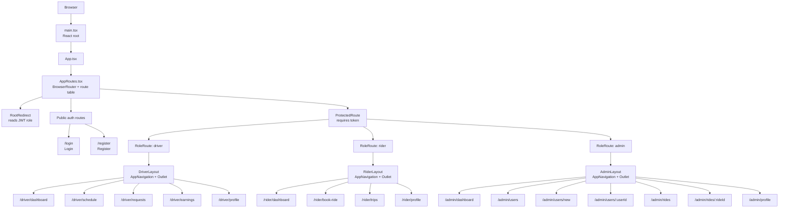
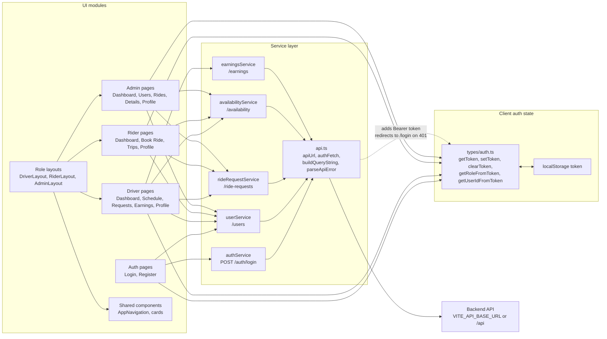
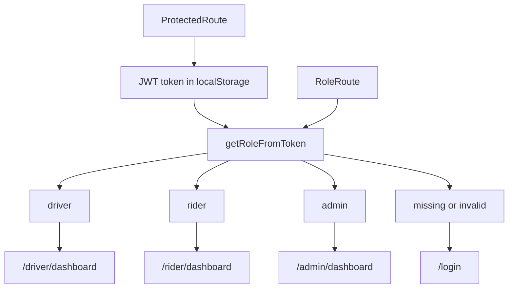

# DirectRide Frontend Architecture

This diagram reflects the current Vite + React app in `direct-ride-web/src`.

## App And Route Structure

```mermaid
flowchart TD
  Browser["Browser"]
  Main["main.tsx<br/>React root"]
  App["App.tsx"]
  Routes["AppRoutes.tsx<br/>BrowserRouter + route table"]

  Browser --> Main --> App --> Routes

  Routes --> RootRedirect["RootRedirect<br/>reads JWT role"]
  Routes --> PublicAuth["Public auth routes"]
  PublicAuth --> Login["/login<br/>Login"]
  PublicAuth --> Register["/register<br/>Register"]

  Routes --> ProtectedRoute["ProtectedRoute<br/>requires token"]
  ProtectedRoute --> DriverRole["RoleRoute: driver"]
  ProtectedRoute --> RiderRole["RoleRoute: rider"]
  ProtectedRoute --> AdminRole["RoleRoute: admin"]

  DriverRole --> DriverLayout["DriverLayout<br/>AppNavigation + Outlet"]
  DriverLayout --> DriverDashboard["/driver/dashboard"]
  DriverLayout --> DriverSchedule["/driver/schedule"]
  DriverLayout --> DriverRequests["/driver/requests"]
  DriverLayout --> DriverEarnings["/driver/earnings"]
  DriverLayout --> DriverProfile["/driver/profile"]

  RiderRole --> RiderLayout["RiderLayout<br/>AppNavigation + Outlet"]
  RiderLayout --> RiderDashboard["/rider/dashboard"]
  RiderLayout --> RiderBookRide["/rider/book-ride"]
  RiderLayout --> RiderTrips["/rider/trips"]
  RiderLayout --> RiderProfile["/rider/profile"]

  AdminRole --> AdminLayout["AdminLayout<br/>AppNavigation + Outlet"]
  AdminLayout --> AdminDashboard["/admin/dashboard"]
  AdminLayout --> AdminUsers["/admin/users"]
  AdminLayout --> AdminAddUser["/admin/users/new"]
  AdminLayout --> AdminUserDetails["/admin/users/:userId"]
  AdminLayout --> AdminRides["/admin/rides"]
  AdminLayout --> AdminRideDetails["/admin/rides/:rideId"]
  AdminLayout --> AdminProfile["/admin/profile"]
```

## Data And Auth Flow

```mermaid
flowchart LR
  subgraph UI["UI modules"]
    AuthPages["Auth pages<br/>Login, Register"]
    RoleLayouts["Role layouts<br/>DriverLayout, RiderLayout, AdminLayout"]
    DriverPages["Driver pages<br/>Dashboard, Schedule, Requests, Earnings, Profile"]
    RiderPages["Rider pages<br/>Dashboard, Book Ride, Trips, Profile"]
    AdminPages["Admin pages<br/>Dashboard, Users, Rides, Details, Profile"]
    SharedComponents["Shared components<br/>AppNavigation, cards"]
  end

  subgraph AuthState["Client auth state"]
    LocalStorage["localStorage token"]
    AuthHelpers["types/auth.ts<br/>getToken, setToken, clearToken,<br/>getRoleFromToken, getUserIdFromToken"]
  end

  subgraph Services["Service layer"]
    AuthService["authService<br/>POST /auth/login"]
    UserService["userService<br/>/users"]
    RideService["rideRequestService<br/>/ride-requests"]
    AvailabilityService["availabilityService<br/>/availability"]
    EarningsService["earningsService<br/>/earnings"]
    ApiHelper["api.ts<br/>apiUrl, authFetch,<br/>buildQueryString, parseApiError"]
  end

  Backend["Backend API<br/>VITE_API_BASE_URL or /api"]

  AuthPages --> AuthService
  AuthPages --> UserService
  AuthPages --> AuthHelpers

  DriverPages --> UserService
  DriverPages --> RideService
  DriverPages --> AvailabilityService
  DriverPages --> EarningsService
  DriverPages --> AuthHelpers

  RiderPages --> UserService
  RiderPages --> RideService
  RiderPages --> AvailabilityService
  RiderPages --> AuthHelpers

  AdminPages --> UserService
  AdminPages --> RideService
  AdminPages --> AvailabilityService
  AdminPages --> AuthHelpers

  RoleLayouts --> SharedComponents
  RoleLayouts --> DriverPages
  RoleLayouts --> RiderPages
  RoleLayouts --> AdminPages

  AuthHelpers <--> LocalStorage
  AuthService --> ApiHelper
  UserService --> ApiHelper
  RideService --> ApiHelper
  AvailabilityService --> ApiHelper
  EarningsService --> ApiHelper
  ApiHelper --> Backend
  ApiHelper -. "adds Bearer token<br/>redirects to /login on 401" .-> AuthHelpers
```

## Role-Based Navigation

```mermaid
flowchart TD
  Token["JWT token in localStorage"] --> RoleParser["getRoleFromToken"]
  RoleParser --> Driver["driver"]
  RoleParser --> Rider["rider"]
  RoleParser --> Admin["admin"]
  RoleParser --> Missing["missing or invalid"]

  Driver --> DriverHome["/driver/dashboard"]
  Rider --> RiderHome["/rider/dashboard"]
  Admin --> AdminHome["/admin/dashboard"]
  Missing --> Login["/login"]

  ProtectedRoute["ProtectedRoute"] --> Token
  RoleRoute["RoleRoute"] --> RoleParser
```
